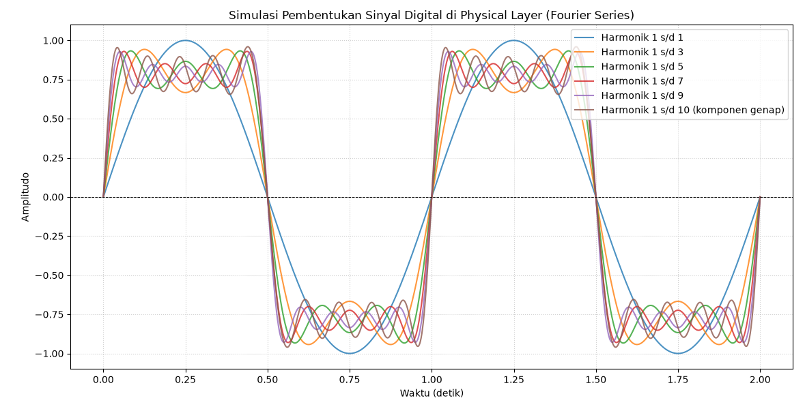

# Laporan Tugas Konsep Jaringan: "Konversi IP"

## A. Konversi IP Address ke Network

### 1. 21.26.8.5

- IP gateway = 21.0.0.1
- Host pertama = 21.0.0.2
- Host terakhir = 21.255.255.254
- Broadcast = 21.255.255.255
- IP network = 21.0.0.0

### 2. 212.68.3

- IP gateway = 212.68.3.1
- Host pertama = 212.68.3.2
- Host terakhir = 212.68.3.254
- Broadcast = 212.68.3.255
- IP network = 212.68.3.0

### 3. 103.24.56.32

- IP gateway = 103.0.0.1
- Host pertama = 103.0.0.2
- Host terakhir = 103.255.255.254
- Broadcast = 103.255.255.255
- IP network = 103.0.0.0

### 4. 1.1.1.1

- IP gateway = 1.0.0.1
- Host pertama = 1.0.0.2
- Host terakhir = 1.255.255.254
- Broadcast = 1.255.255.255
- IP network = 1.0.0.0

### 5. 172.31.16.8

- IP gateway = 172.31.0.1
- Host pertama = 172.31.0.2
- Host terakhir = 172.31.255.254
- Broadcast = 172.31.255.255
- IP network = 172.31.0.0

---

## B. Python Harmonisasi

### Analisa

- **Harmonik 1 (biru):** hanya gelombang sinus murni, bentuknya masih melengkung, jauh dari kotak.
- **Harmonik 1–3 (oranye) hingga 1–9 (ungu):** semakin banyak harmonik ditambahkan, bagian atas/bawah kurva semakin mendatar (*flat-top*) dan sisi naik-turunnya semakin curam/tegak, mendekati bentuk kotak ideal.
- **Harmonik 1–10 termasuk komponen genap (coklat):** bentuknya sedikit menyimpang/tidak simetris dibanding kurva ungu. Ini karena sinyal kotak murni seharusnya hanya tersusun dari harmonik ganjil; penambahan harmonik genap justru merusak kesempurnaan bentuk kotak.

### Makna untuk Physical Layer

Sinyal digital "sempurna" (kotak tajam) secara matematis membutuhkan harmonik tak terhingga → butuh bandwidth tak terhingga. Karena media transmisi nyata (kabel, serat optik, radio) punya bandwidth terbatas, harmonik frekuensi tinggi akan teredam/terpotong. Akibatnya, sinyal yang diterima di ujung penerima tidak pernah benar-benar kotak sempurna, melainkan menyerupai kurva dengan harmonik terbatas (mirip kurva biru/oranye). Inilah sumber distorsi sinyal dan potensi *bit error* jika bandwidth kanal terlalu sempit dibanding kebutuhan sinyal yang dikirim.
