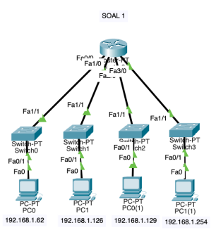
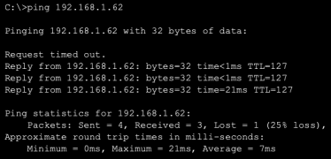
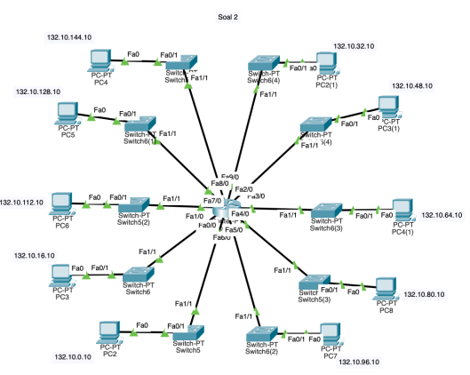
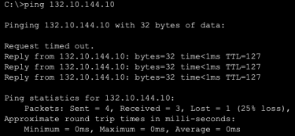
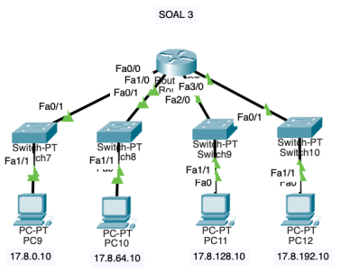
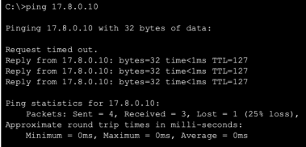
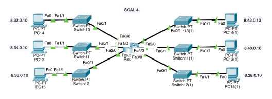
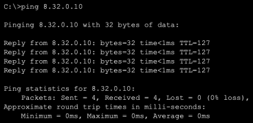

# Laporan Tugas Konsep Jaringan: Subnetting

## 1. 192.168.1.0/24 = 4 subnet

- /24 = 256 IP
- 256 ÷ 4 = 64
- Block size = 64, maka 256 − 64 = 192
- Mask = 255.255.255.192 = /26

| No. | Network | Range Host | Broadcast |
|---|---|---|---|
| 1 | 192.168.1.0/26 | 192.168.1.1 – 192.168.1.62 | 192.168.1.63 |
| 2 | 192.168.1.64/26 | 192.168.1.65 – 192.168.1.126 | 192.168.1.127 |
| 3 | 192.168.1.128/26 | 192.168.1.129 – 192.168.1.190 | 192.168.1.191 |
| 4 | 192.168.1.192/26 | 192.168.1.193 – 192.168.1.254 | 192.168.1.255 |

---

## 2. 132.10.0.0/16 = 10 segment

- Butuh 10 segment: 4 bit subnet dipinjam (2^4 = 16 subnet)
- Prefix baru: /16 + 4 = /20 (Netmask: 255.255.240.0)
- Blok subnet oktet ke-3: 256 − 240 = 16
- Host per subnet: 2^12 − 2 = 4094

| No. | Network | Range Host | Broadcast |
|---|---|---|---|
| 1 | 132.10.0.0/20 | 132.10.0.1 – 132.10.15.254 | 132.10.15.255 |
| 2 | 132.10.16.0/20 | 132.10.16.1 – 132.10.31.254 | 132.10.31.255 |
| 3 | 132.10.32.0/20 | 132.10.32.1 – 132.10.47.254 | 132.10.47.255 |
| 4 | 132.10.48.0/20 | 132.10.48.1 – 132.10.63.254 | 132.10.63.255 |
| 5 | 132.10.64.0/20 | 132.10.64.1 – 132.10.79.254 | 132.10.79.255 |
| 6 | 132.10.80.0/20 | 132.10.80.1 – 132.10.95.254 | 132.10.95.255 |
| 7 | 132.10.96.0/20 | 132.10.96.1 – 132.10.111.254 | 132.10.111.255 |
| 8 | 132.10.112.0/20 | 132.10.112.1 – 132.10.127.254 | 132.10.127.255 |
| 9 | 132.10.128.0/20 | 132.10.128.1 – 132.10.143.254 | 132.10.143.255 |
| 10 | 132.10.144.0/20 | 132.10.144.1 – 132.10.159.254 | 132.10.159.255 |

---

## 3. 17.8.0.0/16 = kelas A dibagi (4 subnet)

- Butuh 4 subnet: 2 bit subnet dipinjam
- Prefix baru: /16 + 2 = /18 (Netmask: 255.255.192.0)
- Blok subnet oktet ke-3: 256 − 192 = 64
- Host per subnet: 2^14 − 2 = 16382

| No. | Network | Range Host | Broadcast |
|---|---|---|---|
| 1 | 17.8.0.0/18 | 17.8.0.1 – 17.8.63.254 | 17.8.63.255 |
| 2 | 17.8.64.0/18 | 17.8.64.1 – 17.8.127.254 | 17.8.127.255 |
| 3 | 17.8.128.0/18 | 17.8.128.1 – 17.8.191.254 | 17.8.191.255 |
| 4 | 17.8.192.0/18 | 17.8.192.1 – 17.8.255.254 | 17.8.255.255 |

---

## 4. 8.32.0.0/12 (kelas A) dibagi 6 subnet

- Butuh 6 subnet: 3 bit subnet dipinjam
- Prefix baru: /12 + 3 = /15 (Netmask: 255.254.0.0)
- Blok subnet oktet ke-2: 256 − 254 = 2
- Host per subnet: 2^17 − 2 = 131070

| No. | Network | Range Host | Broadcast |
|---|---|---|---|
| 1 | 8.32.0.0/15 | 8.32.0.1 – 8.33.255.254 | 8.33.255.255 |
| 2 | 8.34.0.0/15 | 8.34.0.1 – 8.35.255.254 | 8.35.255.255 |
| 3 | 8.36.0.0/15 | 8.36.0.1 – 8.37.255.254 | 8.37.255.255 |
| 4 | 8.38.0.0/15 | 8.38.0.1 – 8.39.255.254 | 8.39.255.255 |
| 5 | 8.40.0.0/15 | 8.40.0.1 – 8.41.255.254 | 8.41.255.255 |
| 6 | 8.42.0.0/15 | 8.42.0.1 – 8.43.255.254 | 8.43.255.255 |

